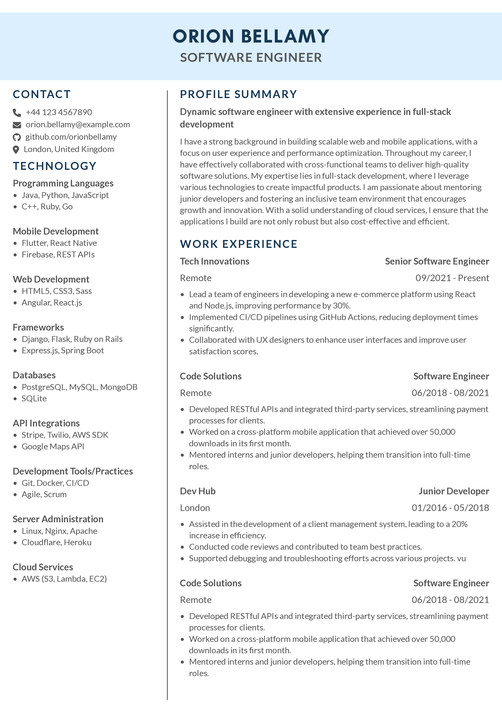

# Typst Blue Header CV

A sleek and professional CV template built with [Typst](https://typst.app/), featuring a stylish blue header for a standout look.



## Table of Contents

- [Installation](#installation)
- [Usage](#usage)
- [Contributing](#contributing)
- [License](#license)
- [Acknowledgements](#acknowledgements)


## Installation

To get started, ensure you have Typst installed. If Typst isn't installed yet, you can download it from [typst.app](https://typst.app/).

1. Clone this repository:

```
   git clone https://github.com/cammellos/typst-blue-header-cv.git
```

2. Navigate into the project directory:

```
   cd typst-blue-header-cv
```

There's a `flake.nix` file that you can use, `direnv` should automatically pick it up.

## Usage

Once you have Typst installed and the project cloned:

1. Open `assets/resume.yaml`
2. Customize the file with your own details.
3. Generate your CV:

   ```
     make
   ```

4. Your PDF will be generated in `assets/resume.pdf`

### Makefile Instructions

This project includes a Makefile to facilitate building, watching for changes, and formatting Typst files. Here are the available commands:

### Commands

- **build**: Compile the Typst file into a PDF using the specified input YAML file and output path.

```
  make build
```

- **watch**: Automatically rebuild the PDF whenever a `.typ` or `.yaml` file changes.

```
  make watch
```

- **png**: Generate a PNG image from the compiled PDF.

```
  make png
```

- **format**: Format the Typst files using Typstyle.

```
  make format
```

### Variables

- **INPUT_FILE**: Specify the input YAML file for the resume (default: `./assets/resume.yaml`).
- **OUTPUT_FILE**: Specify the output PDF file (default: `./assets/resume.pdf`).
- **OUTPUT_IMAGE**: Specify the output PNG file (default: `./assets/resume.png`).

## Contributing

Contributions are welcome! To contribute:

1. Fork the repository.
2. Create a feature branch (git checkout -b feature-name).
3. Commit your changes (git commit -m 'Add feature name').
4. Push to the branch (git push origin feature-name).
5. Open a Pull Request.

## License

This project is licensed under the MIT License. See the [LICENSE](LICENSE) file for details.

## Acknowledgements

This project is built upon the foundation provided by [Harkunwar/attractive-typst-resume](https://github.com/Harkunwar/attractive-typst-resume). Thank you for the inspiration and resources!
